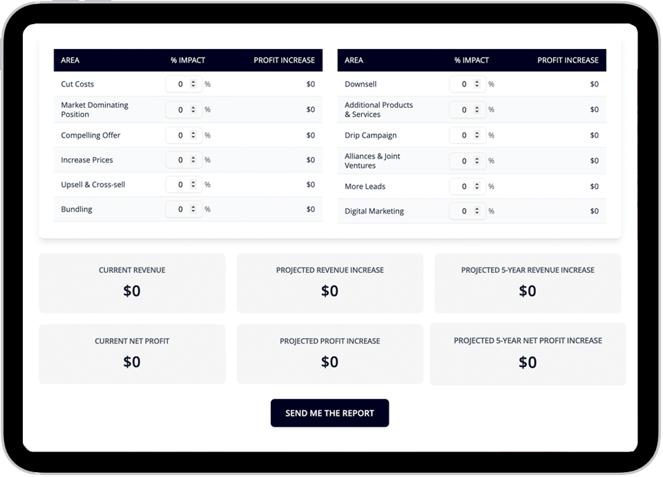
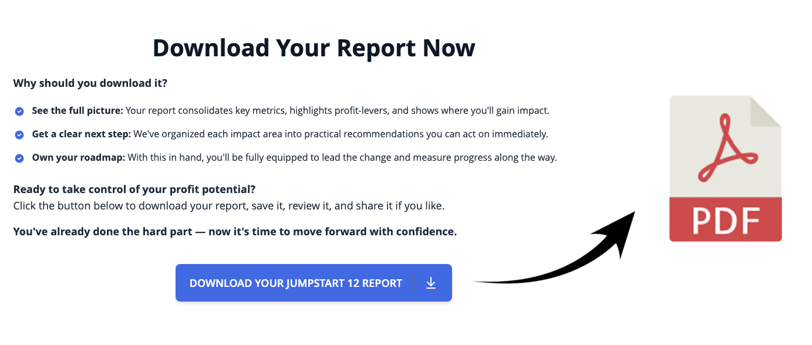

# Profit Acceleration Simulator

A comprehensive business profit acceleration platform that helps companies identify and quantify growth opportunities across 12+ proven strategies. Built with Next.js, this application provides personalized financial projections and actionable roadmaps for business growth.

## 🚀 Features

- **Interactive Business Simulator** - Input revenue, profit margins, and currency to generate custom projections
- **12 Core Growth Strategies** - Analyze impact across areas like pricing optimization, cost reduction, upselling, and market positioning
- **Deep Dive Analysis (DD40)** - Extended analysis with 28 additional growth strategies for comprehensive planning
- **Multi-Currency Support** - Full support for 47+ global currencies with proper localization
- **Professional PDF Reports** - Generate downloadable profit acceleration roadmaps with custom branding
- **Responsive Design** - Optimized for desktop, tablet, and mobile devices
- **Real-time Calculations** - Instant financial projections with precision-focused rounding algorithms

## 🛠 Tech Stack

- **Framework**: Next.js 14 with App Router
- **Styling**: Tailwind CSS v4 with custom design tokens
- **UI Components**: shadcn/ui component library
- **Icons**: Lucide React
- **PDF Generation**: @react-pdf/renderer
- **Database**: Supabase
- **Deployment**: [Your deployment platform]

## 📊 Screenshots

### Business Simulator


_Interactive form for inputting business metrics and growth parameters_

### Strategy Analysis



_Visual breakdown of profit impact across different growth strategies_

### PDF Report Generation



_Professional PDF roadmap with custom calculations and actionable steps_

### Mobile Experience


_Fully responsive design optimized for mobile devices_

## 🎯 Key Calculations

The application uses sophisticated financial algorithms to ensure accuracy:

- **Precision-First Approach**: Calculations maintain full decimal precision, rounding only at display time
- **Compound Growth Modeling**: Revenue increases compound on cumulative totals for realistic projections
- **Strategy-Specific Logic**: Different calculation methods for pricing, cost reduction, and revenue strategies
- **Multi-Year Projections**: 5-year impact calculations for long-term planning

## 🌍 Multi-Currency Support

Supports 47 global currencies including:

- Major currencies (USD, EUR, GBP, CAD, AUD)
- Regional currencies (INR, CNY, JPY, KRW, etc.)
- Emerging market currencies (NGN, KES, BDT, etc.)

## 📁 Project Structure

```
├── app/                    # Next.js app directory
│   ├── simulator/          # Business simulator interface
│   ├── report/[id]/        # Dynamic report pages
│   └── api/                # API routes
├── components/             # React components
│   ├── simulator/          # Simulator-specific components
│   ├── report/             # Report page components
│   └── ui/                 # Reusable UI components
├── data/                   # Static data files
│   ├── currencies.js       # Supported currencies
│   └── strategyContent.js  # Strategy definitions
├── lib/                    # Utilities and configurations
│   ├── calc/               # Financial calculation logic
│   └── db/                 # Database utilities
└── utils/                  # Helper functions
```

## 🔧 Configuration

### Custom Design Tokens

The application uses Tailwind v4 with custom design tokens defined in `globals.css`:

```css
@theme {
  --color-navy: #000321;
  --color-app-primary: #4169e1;
  --color-light-blue: #e3edf7;
  --color-light-gray: #f5f5f5;
}

- **Interactive Business Simulator** - Input revenue, profit margins, and currency to generate custom projections
- **12 Core Growth Strategies** - Analyze impact across areas like pricing optimization, cost reduction, upselling, and market positioning
- **Deep Dive Analysis (DD40)** - Extended analysis with 28 additional growth strategies for comprehensive planning
- **Multi-Currency Support** - Full support for 47+ global currencies with proper localization
- **Professional PDF Reports** - Generate downloadable profit acceleration roadmaps with custom branding
- **Responsive Design** - Optimized for desktop, tablet, and mobile devices
- **Real-time Calculations** - Instant financial projections with precision-focused rounding algorithms

## 🛠 Tech Stack

- **Framework**: Next.js 14 with App Router
- **Styling**: Tailwind CSS v4 with custom design tokens
- **UI Components**: shadcn/ui component library
- **Icons**: Lucide React
- **PDF Generation**: @react-pdf/renderer
- **Database**: Supabase
- **Deployment**: [Your deployment platform]

## 📊 Screenshots

### Business Simulator


*Interactive form for inputting business metrics and growth parameters*

### Strategy Analysis


*Visual breakdown of profit impact across different growth strategies*

### PDF Report Generation


*Professional PDF roadmap with custom calculations and actionable steps*

### Mobile Experience


*Fully responsive design optimized for mobile devices*

## 🎯 Key Calculations

The application uses sophisticated financial algorithms to ensure accuracy:

- **Precision-First Approach**: Calculations maintain full decimal precision, rounding only at display time
- **Compound Growth Modeling**: Revenue increases compound on cumulative totals for realistic projections
- **Strategy-Specific Logic**: Different calculation methods for pricing, cost reduction, and revenue strategies
- **Multi-Year Projections**: 5-year impact calculations for long-term planning

## 🌍 Multi-Currency Support

Supports 47 global currencies including:
- Major currencies (USD, EUR, GBP, CAD, AUD)
- Regional currencies (INR, CNY, JPY, KRW, etc.)
- Emerging market currencies (NGN, KES, BDT, etc.)

## 📁 Project Structure

```

├── app/ # Next.js app directory
│ ├── simulator/ # Business simulator interface
│ ├── report/[id]/ # Dynamic report pages
│ └── api/ # API routes
├── components/ # React components
│ ├── simulator/ # Simulator-specific components
│ ├── report/ # Report page components
│ └── ui/ # Reusable UI components
├── data/ # Static data files
│ ├── currencies.js # Supported currencies
│ └── strategyContent.js # Strategy definitions
├── lib/ # Utilities and configurations
│ ├── calc/ # Financial calculation logic
│ └── db/ # Database utilities
└── utils/ # Helper functions

````

## 🔧 Configuration

### Custom Design Tokens
The application uses Tailwind v4 with custom design tokens defined in `globals.css`:

```css
@theme {
  --color-navy: #000321;
  --color-app-primary: #4169E1;
  --color-light-blue: #e3edf7;
  --color-light-gray: #f5f5f5;
}
````

### Financial Calculations

Calculation logic is modularized in `/lib/calc/`:

- `calculateResults.js` - Core 12 strategies
- `calculateDeepDive.js` - Extended DD40 analysis

### PDF Generation

Professional reports are generated using @react-pdf/renderer with:

- Custom layouts and styling
- Multi-page strategy breakdowns
- Embedded SVG icons for checkmarks
- Dynamic currency formatting

### Database Integration

Supabase integration provides:

- Simulation data persistence
- User report generation
- Real-time data synchronization

## 📈 Business Logic

<<<<<<< HEAD

### Financial Calculations

Calculation logic is modularized in `/lib/calc/`:

- `calculateResults.js` - Core 12 strategies
- `calculateDeepDive.js` - Extended DD40 analysis

### PDF Generation

Professional reports are generated using @react-pdf/renderer with:

- Custom layouts and styling
- Multi-page strategy breakdowns
- Embedded SVG icons for checkmarks
- Dynamic currency formatting

### Database Integration

Supabase integration provides:

- Simulation data persistence
- User report generation
- Real-time data synchronization

## 📈 Business Logic

### Strategy Categories

=======

### Strategy Categories

> > > > > > > 7ee9aa913a1d1e2ffd3b400747b29b49c9363b62

1. **Revenue Optimization** - Pricing, upselling, cross-selling
2. **Cost Management** - Expense reduction and efficiency
3. **Market Expansion** - New products, partnerships, lead generation
4. **Operational Excellence** - Process improvements and automation
   <<<<<<< HEAD

### Calculation Methodology

=======

### Calculation Methodology

> > > > > > > 7ee9aa913a1d1e2ffd3b400747b29b49c9363b62

- Maintains mathematical precision throughout calculations
- Implements banker's rounding for financial accuracy
- Compounds growth effects realistically across strategies
- Provides both percentage and absolute impact metrics

## 🎨 Design Philosophy

- **Precision over Convenience**: Financial calculations prioritize mathematical accuracy
- **User-Centric Experience**: Clean, intuitive interface for complex business analysis
- **Professional Output**: High-quality PDF reports suitable for client presentations
- **Accessibility**: Responsive design with proper contrast and typography

## 📄 License

This project is proprietary software. All rights reserved.

## 🙏 Acknowledgments

- Built with precision financial calculations following industry best practices
- Inspired by proven business acceleration methodologies
- Designed for entrepreneurs, consultants, and business analysts

---

#**[Live Demo](your-demo-url)** | **[Contact](your-contact-url)**
